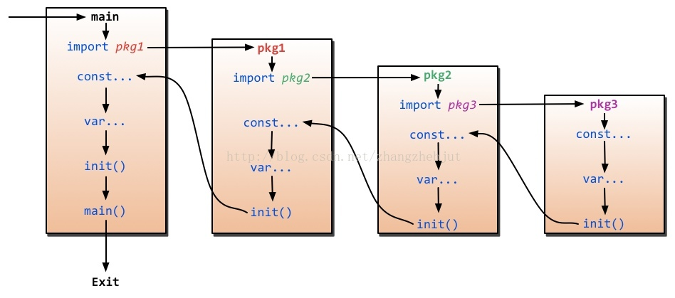

# import 导包

## 导入过程

程序的初始化和执行都起始于main包。如果main包还导入了其它的包，那么就会在编译时将它们依次导入。有时一个包会被多个包同时导入，那么它只会被导入一次（例如很多包可能都会用到fmt包，但它只会被导入一次，因为没有必要导入多次）。当一个包被导入时，如果该包还导入了其它的包，那么会先将其它包导入进来，然后再对这些包中的包级常量和变量进行初始化，接着执行init函数（如果有的话），依次类推。等所有被导入的包都加载完毕了，就会开始对main包中的包级常量和变量进行初始化，然后执行main包中的init函数（如果存在的话），最后执行main函数。下图详细地解释了整个执行过程：




通过上面的介绍我们了解了import的时候其实是执行了该包里面的init函数，初始化了里面的变量，_操作只是说该包引入了，只初始化里面的init函数和一些变量，不能通过包名来调用其它的函数，这有什么用呢？往往这些init函数里面是注册自己包里面的引擎，让外部可以方便的使用，就很多实现database/sql的引起，在init函数里面都是调用了sql.Register(name string, driver driver.Driver)注册自己，然后外部就可以使用了。

## 导入方式

##### 常用方式

```go
import (
	"fmt"
)
```

##### 下划线 import (匿名导入)

go 语言如果导入某个包，但没使用到导入的包，是会报错的。那么如何使程序不报错呢？可以使用匿名导入包的形式

在导入包名前加 `_` 就表示这个包是匿名导入的

```go
import (
	_ "fmt"
)
```

##### 别名 import

```go
import (
	f "fmt"
)
```

##### 点 import

点 import 就是在 import 的包前面加个`.` , 这个导入方式，在使用相应的包的函数或者变量的时候，可以省略包名。

```go
import (
	. "fmt"
)
```

