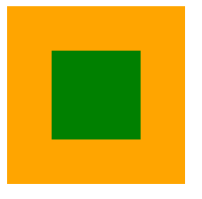
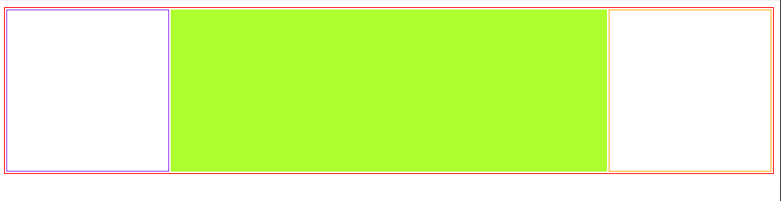

#### 如图让元素居中 



```html
<div id="box">
    <div id="x"></div>
</div>
```

#### 方法1、定位`可兼容ie8` （也可以用 transform:translate(-50%,-50%)）`最常用方法`

```css
#box{
    width: 200px;
    height: 200px;
    background: orange;
    position: relative;
}
#x{
    width: 200px;
    height: 200px;
    background: green;
    position: absolute;
    left: 50%;
    top: 50%;
    margin-left: -50px;
    margin-top: -50px;
}
```

#### 方法2、定位结合left,right,top

```css
#box{
    width: 200px;
    height: 200px;
    background: orange;
    position: relative;
}
#x{
    height: 100px;
    background: green;
    position: absolute;
    top: 50px;
    left: 50px;
    right: 50px;
}
```

#### 方法3、margin结合bfc盒子

```css
#box{
    width: 200px;
    height: 200px;
    background: orange;
    display: inline-block;  // 将盒子变成BFC, 这样里面的子盒子x margin-top:50px 才能生效
}
#x{
    width: 100px;
    height: 100px;
    background: green;
    margin: 0 auto;
    margin-top: 50px;
}
```

#### 方法4、定位，子元素所有定位为0，margin设置auto自适应。

```css
// 方法一
#box{
    width: 400px;
    height: 400px;
    background: red;
    position: relative;
}
#x{
    width: 200px;
    height: 200px;
    background: yellow;
    position: absolute;
    left: 0;
    top: 0;
    right: 0;
    bottom: 0;
    margin: auto;
}


```

#### 方法5、flex弹性盒

```css
#box{
    width: 400px;
    height: 400px;
    background: red;
    display: flex;
    justify-content: center;
    align-items: center;
}
#x{
    width: 200px;
    height: 200px;
    background: yellow;
}
```

#### 方法6、table布局 `可兼容ie6`



```html
<table>
    <tr>
        <td></td>
        <td></td>
        <td></td>
    </tr>
</table>

<style>
  table {
    width: 100%;
    height: 200px;
    border: 1px solid red;
  }
  table tr td:nth-child(1) {
    width: 200px;
    height: 200px;
    border: 1px solid blueviolet;
  }
  table tr td:nth-child(2) {
    height: 200px;
    background: greenyellow;
  }
  table tr td:nth-child(3) {
    width: 200px;
    height: 200px;
    border: 1px solid orange;
  }
</style>
```

