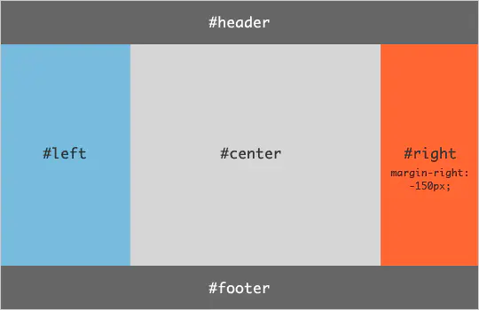

## 三栏布局/圣杯布局/双飞翼布局

圣杯布局和双飞翼布局是前端工程师需要日常掌握的重要布局方式。两者的功能相同，都是为了实现一个两侧宽度固定，中间宽度自适应的三栏布局。（中间先加载渲染）


## 圣杯布局

- 两侧宽度固定，中间宽度自适应
- 中间部分在 DOM 结构上优先，以便先行渲染
- 允许三列中的任意一列成为最高列
- 只需要使用一个额外的 `<div >` 外层标签

#### DOM 结构

```html
<body>
  <div id="header"></div>
  <div id="container">
    <div id="center" class="column"></div>
    <div id="left" class="column"></div>
    <div id="right" class="column"></div>
  </div>
  <div id="footer"></div>
</body>
```

首先定义出整个布局的 DOM 结构，主体部分是由`container`包裹的`center,left,right`三列，其中`center`定义在最前面。

#### CSS 代码

假设左侧的固定宽度为 200px，右侧的固定宽度为 150px，则首先在 container 上设置：

```css
#container {
  padding-left: 200px;
  padding-right: 150px;
}
```

为左右两列预留出相应的空间，得到如下示意图：


随后分别为三列设置宽度与浮动，同时对 footer 设置清除浮动：

```css
#container .column {
  float: left;
}

#center {
  width: 100%;
}

#left {
  width: 200px;
}

#right {
  width: 150px;
}

#footer {
  clear: both;
}
```

得到如下效果：


根据浮动的特性，由于`center`的宽度为`100%`，即占据了第一行的所有空间，所以`left`和 r`ight`被“挤”到了第二行。

接下来的工作是将 left 放置到之前预留出的位置上，这里使用负外边距:

```css
#left {
  width: 200px;
  margin-left: -100%;
}
```

得到：


随后还需要使用定位(position)方法：

```css
#left {
  width: 200px;
  margin-left: -100%;
  position: relative;
  right: 200px;
}
```

这里使用 `position: relative ` 和 `right: 200px` 将 left 的位置在原有位置基础上左移 `200px`，以完成 `left` 的放置：


接下来放置 right，只需添加一条声明即可：

```js
#right {
  width: 150px;
  margin-right: -150px;
}
```

得到最终的效果图：



!>至此，布局效果完成。不过还需要考虑最后一步，那就是页面的最小宽度：要想保证该布局效果正常显示，由于两侧都具有固定的宽度，所以需要给定页面一个最小的宽度，但这并不只是简单的 200+150=350px。回想之前 left 使用了 position: relative，所以就意味着在 center 开始的区域，还存在着一个 left 的宽度。所以页面的最小宽度应该设置为 200+150+200=550px：

```css
body {
  min-width: 550px;
}
```

综上所述，圣杯布局的 CSS 代码为：

```css
body {
  min-width: 550px;
}

#container {
  padding-left: 200px;
  padding-right: 150px;
}

#container .column {
  float: left;
}

#center {
  width: 100%;
}

#left {
  width: 200px;
  margin-left: -100%;
  position: relative;
  right: 200px;
}

#right {
  width: 150px;
  margin-right: -150px;
}
```

## 双飞翼布局

#### DOM 结构

```html
<body>
  <div id="header"></div>
  <div id="container" class="column">
    <div id="center"></div>
  </div>
  <div id="left" class="column"></div>
  <div id="right" class="column"></div>
  <div id="footer"></div>
  <body></body>
</body>
```

双飞翼布局的 DOM 结构与圣杯布局的区别是用 `container` 仅包裹住 `center`，另外将 `.column` 类从 `center` 移至 `container` 上

#### CSS 代码

按照与圣杯布局相同的思路，首先设置各列的宽度与浮动，并且为左右两列预留出空间，以及为`footer`设置浮动清除

```css
#container {
  width: 100%;
}

.column {
  float: left;
}

#center {
  margin-left: 200px;
  margin-right: 150px;
}

#left {
  width: 200px;
}

#right {
  width: 150px;
}

#footer {
  clear: both;
}
```

得到如下效果示意图：


以上代码将 `container,left,right` 设置为 `float: left`，而在 `container` 内部，`center `由于没有设置浮动，所以其宽度默认为 `container` 的 100%宽度，通过对其设置 `margin-left` 和 `margin-right` 为左右两列预留出了空间

将 left 放置到预留位置：

```css
#left {
  width: 200px;
  margin-left: -100%;
}
```

得到：


将 right 放置到预留位置：

```css
#right {
  width: 150px;
  margin-left: -150px;
}
```

得到最终效果：


最后计算最小页面宽度：由于双飞翼布局没有用到 position:relative 进行定位，所以最小页面宽度应该为 200+150=350px。但是当页面宽度缩小到 350px 附近时，会挤占中间栏的宽度，使得其内容被右侧栏覆盖，如下所示：


因此在设置最小页面宽度时，应该适当增加一些宽度以供中间栏使用（假设为 150px），则有：

```css
body {
  min-width: 500px;
}
```

至此双飞翼布局大功告成！其布局整体代码为：

```css
body {
  min-width: 500px;
}

#container {
  width: 100%;
}

.column {
  float: left;
}

#center {
  margin-left: 200px;
  margin-right: 150px;
}

#left {
  width: 200px;
  margin-left: -100%;
}

#right {
  width: 150px;
  margin-left: -150px;
}

#footer {
  clear: both;
}
```

#### 总结与思考

通过对圣杯布局和双飞翼布局的介绍可以看出，圣杯布局在 DOM 结构上显得更加直观和自然，且在日常开发过程中，更容易形成这样的 DOM 结构（通常 `<aside>和<article> / <section>`一起被嵌套在 `<main>` 中）；而双飞翼布局在实现上由于不需要使用定位，所以更加简洁，且允许的页面最小宽度通常比圣杯布局更小

## 使用 Flex 布局圣杯布局

这里使用 `flex` 还是需要与圣杯布局相同的 DOM 结构，不过在实现上将更加简单

```html
<body>
  <div id="header"></div>
  <div id="container">
    <div id="center" class="column"></div>
    <div id="left" class="column"></div>
    <div id="right" class="column"></div>
  </div>
  <div id="footer"></div>
</body>

<style>
  #container {
    display: flex;
  }

  #center {
    flex: 1;
  }

  #left {
    flex: 0 0 200px;
    order: -1;
  }

  #right {
    flex: 0 0 150px;
  }
</style>
```
