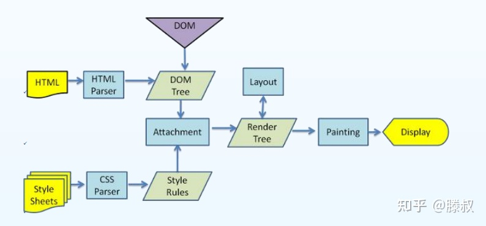

# 浏览器渲染机制

浏览器解析渲染页面分为以下五个步骤：

1. 解析HTML标签，构建DOM树；
2. 解析CSS，构建CSSOM树；
3. 把DOM和CSSOM组合成 渲染树（render tree）；
4. 在渲染树的基础上进行布局，计算每个节点的几何结构；
5. 把每个节点绘制到屏幕上（painting）。

## 一、渲染流程

### 1、解析HTML标签，构建DOM树

- DOM树（文本对象模型），根据HTML的内容，将标签按照结构解析成DOM树，DOM构建是增量的，HTML响应编程令牌（token），令牌变成节点，而节点又变成DOM树。
- 在读取HTML文档，***构建DOM树的过程中，若遇到script标签，则DOM树的构建会暂停，直至脚本执行完毕**。*

### 2、解析CSS，构建CSSOM树

- DOM 包含页面所有的内容。CSSOM 包含了页面所有的样式，也就是如何展示 DOM 的信息。
- ***浏览器会阻塞页面渲染直到它接收和执行了所有的 CSS。***

### 3、把DOM和CSSOM组合成渲染树

- 渲染树包括了内容和样式：DOM和CSSOM树结合为渲染树。为了构造渲染树，浏览器检查每个节点，从DOM树的根节点开始，并且决定了哪些CSS规则被添加。
- 渲染树只包含课件内容。头部（通常）不包含任何可显示的信息，因此不在渲染树中。如果元素上有 display：none； ，他本身及其后代都不会出现渲染树中。

### 4、在渲染树的基础上进行布局，计算每个节点的几何结构

- 布局：通过渲染树中渲染对象的信息，计算出每个渲染对象的位置和尺寸。
- 回流：布局完成后，绘制界面的某个部分发生变化，就需要重新渲染。

### 5、把每个节点绘制到屏幕上

- 最后一步是将像素绘制在屏幕上。一点渲染树创建并不就完成，像素就可以被绘制在屏幕上。

## 二、Reflow和Repaint

- Reflow（回流）：当浏览器上某个未知的布局发生变化，浏览器就会重新从根不计算该节点的布局，重新验证并计算Render树。
- Repaint（重绘）：只改变页面元素颜色、字体等不影响布局的属性时，浏览器会重新渲染ender树，进行重绘操作。
- 两者的区别就是页面的布局是否改变。