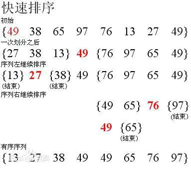

# 数组排序

## 冒泡排序

将[数组](https://so.csdn.net/so/search?q=数组&spm=1001.2101.3001.7020)中的相邻两个元素进行比较，将比较大（较小）的数通过两两比较移动到数组末尾（开始），执行一遍内层循环，确定一个最大（最小）的数，外层循环从数组末尾（开始）遍历到开始（末尾）


```js
function MaoPaoSort(arr) {
  for (var i = 0; i < arr.length - 1; i++) {
    for (var j = 0; j < arr.length - i - 1; j++) {
      if (arr[j] > arr[j + 1]) {
        //把大的数字放到后面
        var str = arr[j]
        arr[j] = arr[j + 1]
        arr[j + 1] = str
      }
    }
  }
}
var arr = [3, 5, 1, 2, 7, 8, 4, 5, 3, 4]
//console.log(arr);[3,5,1,2,7,8,4,5,3,4];
MaoPaoSort(arr)
//console.log(arr);[1, 2, 3, 3, 4, 4, 5, 5, 7, 8]
```

## 插队排序

将要排序的数组分成两部分，每次从后面的部分取出索引最小的元素插入到前一部分的适当位置


- 从第一个元素开始，该元素可以认为已经被排序；
- 取出下一个元素，在已经排序的元素序列中从后向前扫描；
- 如果该元素（已排序）大于新元素，将该元素移到下一位置；
- 重复步骤 3，直到找到已排序的元素小于或者等于新元素的位置；
- 将新元素插入到该位置后；
- 重复步骤 2~5。

```js
function InsertSort(arr) {
  let len = arr.length
  let preIndex, current
  for (let i = 1; i < len; i++) {
    preIndex = i - 1
    current = arr[i]
    while (preIndex >= 0 && current < arr[preIndex]) {
      arr[preIndex + 1] = arr[preIndex]
      preIndex--
    }
    arr[preIndex + 1] = current
  }
  return arr
}

var arr = [3, 5, 7, 1, 4, 56, 12, 78, 25, 0, 9, 8, 42, 37]
InsertSort(arr)
```

## 快速排序

在看完上面的东西之后，不知道大家有没有发现在实际的工作中如果数据量过大，数组比较复杂，通过两次[遍历](https://so.csdn.net/so/search?q=遍历&spm=1001.2101.3001.7020)，同时会带来性能上的问题，不用慌，我们还可以用快速排序的方法进行解决，`快速排序对冒泡排序的一种改进`



实现思路是，将一个数组的排序问题看成是两个小数组的排序问题，以一个数为基准(中间的数)，比基准小的放到左边，比基准大的放到右边，而每个小的数组又可以继续看成更小的两个数组，一直递归下去，直到数组长度大小最大为 2。

```js
function quickSort(arr) {
  //如果数组长度小于1，没必要排序，直接返回
  if (arr.length <= 1) return arr
  //pivot 基准索引，长度的一半
  let pivotIndex = Math.floor(arr.length / 2) //奇数项向下取整
  //找到基准，把基准项从原数组删除
  let pivot = arr.splice(pivotIndex, 1)[0]
  //定义左右数组
  let left = []
  let right = []
  //把比基准小的放left,大的放right
  arr.forEach(element => {
    if (element < pivot) {
      left.push(element)
    } else {
      right.push(element)
    }
  })
  return quickSort(left).concat([pivot], quickSort(right))
}

var arr = [4, 56, 3, 67, 44, 5, 66]
console.log(quickSort(arr)) //[3, 4, 5, 44, 56, 66, 67]
```
