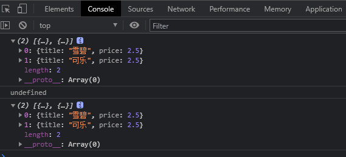
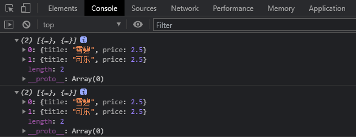
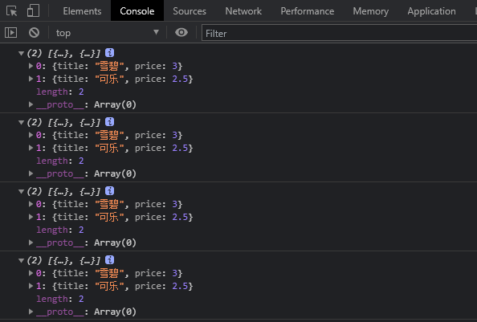
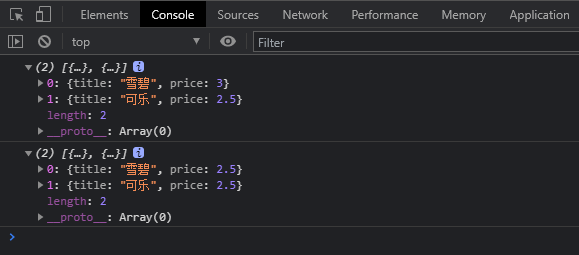

# map 和 foreach 的区别

#### 相同点

- 都是循环遍历数组中的每一项
- 每次执行匿名函数都支持三个参数，参数分别为 item(当前每一项)，index(索引值)，arr(原数组)
- 匿名函数中的 this 都是指向 window
- 都只能遍历数组

#### 不同点

- forEach() 方法不会返回执行结果，而是返回 undefined。map() 方法会分配内存空间存储新数组，并返回新数组。
- 总的来说 map 的速度大于 forEach。
- map() 因为返回新数组，更适合结合 filter(), reduce() 等链式调用组合使用
- forEach 遍历通常都是直接引入当前遍历数组的内存地址，生成的数组的值发生变化，当前遍历的数组对应的值也会发生变化。map遍历后的数组通常都是生成一个新的数组，新的数组的值发生变化，当前遍历的数组值不会变化。


**map() 结合 filter() 组合使用**

```js
let arr = [1, 2, 3, 4, 5];
let arr2 = arr.map(num => num * 2).filter(num => num > 5);
// arr2 = [6, 8, 10]
```

***对于上面不同点最后一点可能存在疑惑，没关系，通过下面案例可以让你豁然开朗。***

这里我为什么都说遍历后通常是引入当前遍历数组的内存地址和生成一个新的数组，因为按forEach和map创作思想，forEach遍历基本引入遍历数组内存地址、map遍历而是生成一个新的数组，***但是有些人写的时候不按map和forEach的常规语法来，导致使用map遍历数组时，返回的值是直接把当前遍历数组的每个元素的内存地址给了另外一个数组，本质还是引用遍历数组中每个元素的内存地址，这样生成的数组已经不能称作为一个新的数组同样也把map最大的一个特性给舍弃了***，同理如果map和forEach本质没区别的话，开发人员没必要把他们封装成两个函数，封装成一个就好了。

下面带着代码一步步发现真相

案例一：

```js
let arr = [
    {
        title:'雪碧',
        price: 2.5,
    },
    {
        title:'可乐',
        price: 2.5,
    }
]

let a = arr.forEach((item,index) =>{
    return item
})

let b = arr.map((item,index) =>{
    return item
})

console.log(arr) //打印arr数组
console.log(a) //undefined
console.log(b) //打印arr数组
```



从案例一可以看出来，map方法是有返回值的，而forEach方法没有返回值，但是如果用map方法想让b获取arr的数组的值，不建议案例一中的写法，因为上面我们已经说到了map方法主要是生成一个新的数组，而不是直接引入arr数组内存地址，如果有不明白的我们来看下面的案例你就会懂了。


案例二：

```js
let arr = [{title:'雪碧',price: 2.5},{title:'可乐',price: 2.5}]

let list = [{title:'雪碧',price: 2.5},{title:'可乐',price: 2.5}]

let a = [];
let b = [];

arr.forEach((item,index) =>{
a[index] = item;
})

b = list.map((item,index) =>{
return item
})

console.log(a)
console.log(b)
```



到这里我们可以看到，a和b都已经成功的接收了arr和list的数组的数据，上面我一直强调 map 一定不要直接 return item，这里这么写主要是为了让你们区分生成新数组和内存地址的区别

```js
a[0].price = 3;
b[0].price = 3;

console.log(a);
console.log(b);

console.log(arr)
console.log(list)
```



从这里我们看到只更改了a和b中price值，但是arr和list数组price的值也发生了变化，arr发生变化属于正常现象，因为在上述中已经说过forEach方法遍历通常都是引入遍历数组的内存地址，不管是arr发生改变还是a发生改变，其实都是直接改变同一个内存地址，所以他们的值会一直同步，但是map方法不是说生成的是一个新的数组，为什么b的值发生改变，list值同样发生改变呢，这里就是上述说的内存地址引入问题。


案例三：

```js
b = list.map((item,index) =>{
    return{
        title:item.title,
        price:item.price
    }
})

b[0].price = 3;

console.log(b);
console.log(list)
```




在这里我们改变一下写法，就会发现现在在改变 b 值的，list 的就不会发生变化了，案例二中改变 b 的值，list 的值发现变化是因为虽说map 遍历后生成的是一个新的数组，但是在遍历的过程还是引入旧数组的内容地址，而在案例三中我们通过 map 遍历的时候自己定义一下想要参数名，只复制一下旧数组的值，遍历完后会生成新的内存空间去存储 b 的值，所以我们在改变b的值时候也只是改变了b内存中的值，而没有改变list内存的值，同样的在改变list的值，b的值也不会发现改变，所以说 map 方法遍历后会生成一个新的数组。
