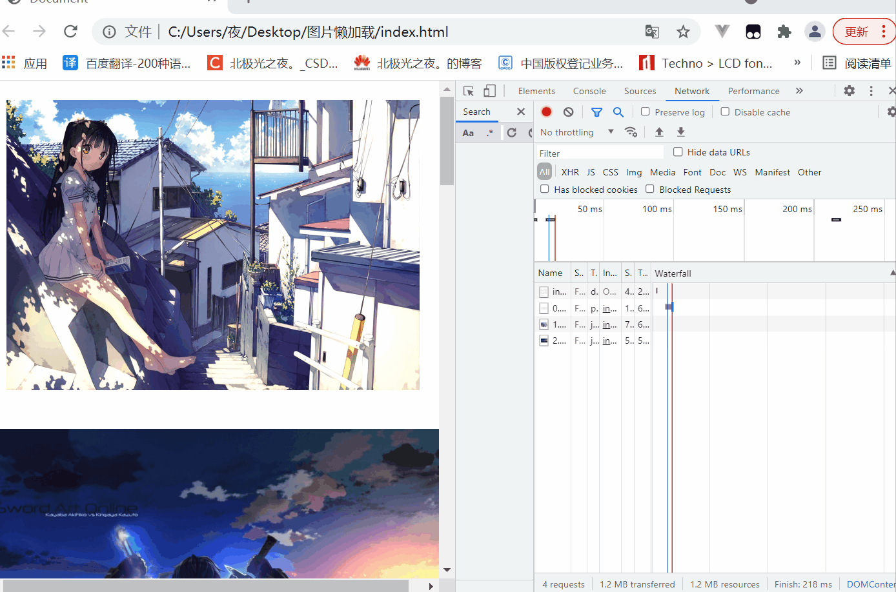

# 图片懒加载

用户滚动相应可视区域，若可视区域有图片便加载，而在可视区域外未加载过的图片它们先不加载。


**html 结构**

```html


```

**懒加载效果**



## 方法一

```js
//获取全部需要懒加载的 img 
const images = document.getElementsByTagName("img");

//当发生滚动事件时调用lazyLoadImg事件
window.addEventListener("scroll", (e) => {
    lazyLoadImg();
});

function lazyLoadImg() {
    // 滚动条垂直滚动高度
    const scrollHeight =  window.scrollY || document.body.scrollTop || document.documentElement.scrollTop
    // 遍历每一张图
    for (let i of images) {
        //判断当前图片是否在可视区内
        if (i.offsetTop <= window.innerHeight + scrollHeight) {
            //获取自定义data-src属性的值
            let trueSrc = i.getAttribute("data-src");
            //把值赋值给图片的src属性
            i.setAttribute("src", trueSrc);
        }
    }
}

//没发生滚动事件时也要先执行一次
lazyLoadImg();
```

其中， offsetTop 为元素距离顶部的距离；window.innerHeight 为当前窗口的高度；window.scrollY 为滚动距离；不难知道，当 i.offsetTop <= window.innerHeight + window.scrollY时图片就处于窗口可视区了。

## 方法二

```js
//获取全部需要懒加载的 img 
const images = document.getElementsByTagName("img");

window.addEventListener("scroll", (e) => {
    lazyLoadImg();
});

function lazyLoadImg() {
    for (let i of images) {
        //计算方式和第一种方式不同
        if (i.getBoundingClientRect().top < window.innerHeight) {
            let trueSrc = i.getAttribute("data-src");
            i.setAttribute("src", trueSrc);
        }
    }
}
lazyLoadImg();
```

其中，getBoundingClientRect().top 为元素相对于窗口的位置；window.innerHeight 为当前窗口的高度；当元素对于窗口的位置小于当前窗口的高度时，那自然处于了窗口可视区了。

## 方法三

使用浏览器原生提供的构造函数 **IntersectionObserver** 观察器接口。IntersectionObserver 可以不用监听 scroll 事件，做到元素一可见便调用回调，在回调里面我们来判断元素是否可见。其中有一个isIntersecting属性，当目标元素在视口看得见为它true，不在时它为 false。

**IntersectionObserver 使用方式**

```js
let io = new IntersectionObserver(callback, option)

// 开始观察
io.observe(document.getElementById("example"))

// 停止观察
io.unobserve(element)

// 关闭观察器
io.disconnect()
```

`callback` 函数的参数（`entries`）是一个数组，每个成员都是一个 `IntersectionObserverEntry` 对象。举例来说，如果同时有两个被观察的对象的可见性发生变化，`entries`数组就会有两个成员。

**callback 参数**

目标元素的可见性变化时，就会调用观察器的回调函数 `callback`

`callback` 一般会触发两次。一次时目标元素刚刚进入视窗（开始可见），另一次时完全离开视窗（开始不可见）

```js
let io = new IntersectionObserver(
    entries => {
        console.log(entries)
    }
)
```

**IntersectionObserverEntry 对象**

`IntersectionObserverEntry` 对象提供目标元素的信息，一共有六个属性

- time: 可见性发生变化的时间，单位毫秒
- target：被观察的目标，是个 DOM 节点对象
- rootBounds：根元素的矩形区域的信息，getBoundingClientRect() 方法的返回值，如果没有根元素（即直接相对于视窗滚动），则返回null
- boundingClientRect：目标元素的矩形区域的信息
- intersectionRect：目标元素与视窗（或根元素）的交叉区域的信息
- **intersectionRatio**：目标元素的可见比例，即 intersectionRect 占 boundingClientRect 的比例，完全可见时为1，完全不可见时小于等于 0


**完整示例**

```js
const lazyImageObserver  = new IntersectionObserver(lazyLoadImg);

function lazyLoadImg(entries) {
    for (let i of entries) {
        if (i.isIntersecting) {
            let img = i.target;
            let trueSrc = img.getAttribute("data-src");
            img.setAttribute("src", trueSrc);
            // 对图片取消观察
            lazyImageObserver.unobserve(img);
        }
    } 
}


const images = document.getElementsByTagName("img");
// 遍历所有图片
for (let i of images) {
    // 对图片进行观察
    lazyImageObserver.observe(i);
}
```

## 总结

- 前两种方法单纯使用 scroll 滑动来监听高度，会引发性能问题，所以要搭配节流
- 最后一种通过 IntersectionObserver Api 实现没有性能问题，但是有浏览器兼容问题。兼容性适配iOS12.2以上，安卓5以上