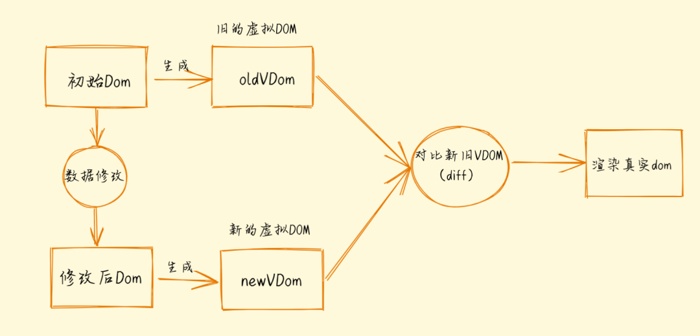

## 虚拟DOM

虚拟DOM，也就是虚拟节点。本质上是使用 js 对象来模拟真实DOM结构。

##### 虚拟dom

```js
const vnode = {
    tag: 'div',
    props: {
        id: 'container',
    },
    children: [{
        tag: 'div',
        props: {
            class: 'content',
        },
        text: 'This is a container'
    }]
}
 
//对应的真实DOM结构
<div id="container">
  <div class="content">
    This is a container
  </div>
</div>
```

tag 用来描述标签，props 用来描述属性，children 用来表示嵌套的层级关系

## VUE 为什么引入虚拟DOM

- 虚拟DOM能够通过比对后进行针对性更新，但不是唯一的方案。Vue.js可以观察到状态的变化，并且绑定到视图，根本不需要比对。

- 事实上，在Vue2.0之前是这样实现的。但是这样做有一定代价，因为粒度太细，每绑定一个都会有一个对应的watcher来观察状态的变化，这样就会有一些内存开销以及一些依赖追踪的开销。对于大型项目来说，这个开销是非常大的。

- 所以，从Vue2.0开始，Vue引入了虚拟DOM。从一个节点生成一个Watcher实例变为一个组件生成一个Watcher实例。也就是说，即便一个组件内有10个节点使用了某个状态，但其实也只有一个Watcher在观察这个状态的变化。状态变化时，只能通知到组件，然后在组件内部通过虚拟DOM去比对与渲染。
  

## 使用虚拟DOM的意义

虚拟DOM的更新不会立即操作DOM，而是会通过diff算法，找出需要更新的节点，按需更新，并将更新的内容保存为一个js对象，更新完成后再挂载到真实dom上，实现真实的dom更新。通过虚拟DOM，解决了操作真实DOM的三个问题

- 减少了频繁操作DOM更新，造成性能问题
- 不断的修改真实的DOM会引发回流和重绘，大大降低了页面的渲染能力
- 开发体验

## 优点

- **跨平台**
  - 保存的是js对象，具备跨平台能力，一套代码多端运行。

- **性能好**
  - 无需频繁更新DOM，减少回流与重绘，提高了性能。

- **简单方便**
  - 无需操作真实DOM，表达力更强，数据更新更加方便。


## 不足

- 虚拟DOM同样也有缺点，首次渲染大量DOM时，由于多了一层虚拟DOM的计算，会比innerHTML插入慢。

## 虚拟DOM实现原理

主要分三部分

- 通过 js 建立与真实DOM节点对应的虚拟节点 vnode 节点描述对象
- 每次生成虚拟节点 vnode 都会缓存下来，diff 算法比较分析新旧两个虚拟 DOM 差异
- 将差异 patch 到真实 dom 上实现更新

