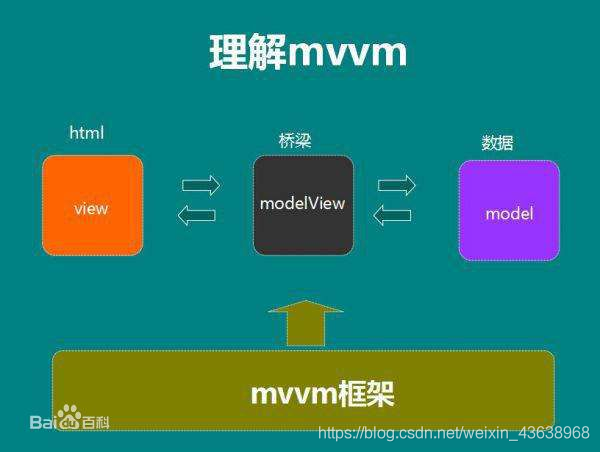
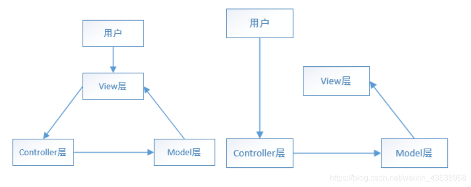

## MVVM

MVVM 是 `Model-View-ViewModel` 的缩写，分别对应着：`数据，视图，视图模型`。Model是我们应用中的数据模型，View是我们的UI视图层，通过ViewModle，可以把我们Modle中的数据映射到View视图上，同时，在View层修改了一些数据，也会反应更新我们的Modle。简单理解就是双向数据绑定，即当数据发生变化的时候，视图也就发生变化，当视图发生变化的时候，数据也会跟着同步变化

**以vue为例**

View 对应 template，ViewModel 对应 `new Vue({…})`，Model对应 data

**三者的关系**

view 可以通过事件绑定(或v-model指令)的方式影响 model，model 可以通过数据绑定的形式影响到 view，viewModel 是把 model 和 view 连起来的连接器

## MVC（典型的框架有angular.js，php）

MVC 是 `Model、View、Controller`即` 数据模型、视图、控制器`

View：视图层；
Model：业务数据层；
Controller： 控制器。接收View层传递过来的指令，选取Model层对应的数据，进行相应操作

**特点**：MVC有如下两种模式，不管哪种模式，MVC的通信都是单向的，由图也可以看出，View层会从Model层拿数据，因此MVC中的View层和Model层还是存在耦合的

